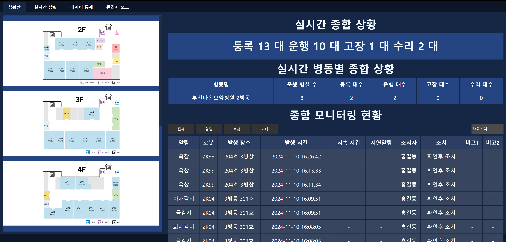
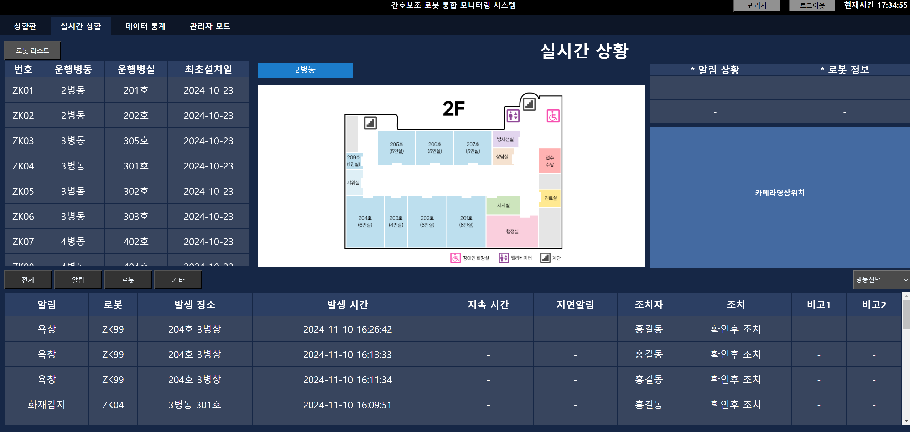
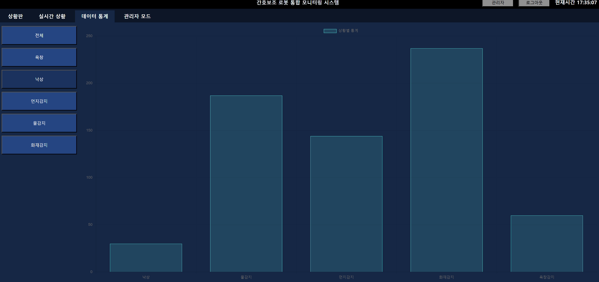
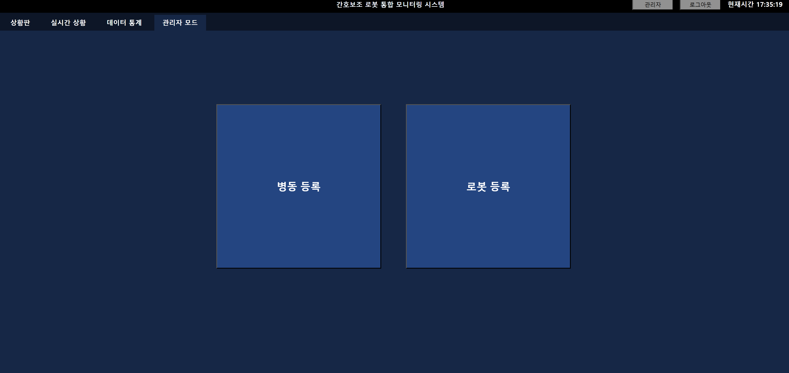

## 📌 ATS 모니터링 시스템

ATS 모니터링 시스템은 다수의 요양병원이 함께 사용하는 환경 데이터 모니터링 웹 애플리케이션입니다. 
각 병원은 고유한 아이디로 로그인하며, 로그인한 병원에 맞는 데이터만 조회 및 관리할 수 있도록 설계되었습니다.  

요양병원 내에서 로봇이 온도, 습도, 공기질, 낙상·욕창 위험 감지 데이터 등을 실시간으로 수집하며, 
이 데이터를 병원별로 구분하여 관리하고 각 병원의 운영에 최적화된 분석 및 모니터링 기능을 제공합니다.  

본 시스템을 통해 각 병원은 실시간으로 환경 상태를 모니터링하고, 이상 발생 시 즉각적인 대응이 가능하도록 하였습니다.

---

📌 주요 기능

1️⃣ 병원별 로그인 및 데이터 필터링
- 사용자 로그인 시, 해당 병원에 맞는 데이터만 조회 가능
- 병원별 대시보드 제공 → 로그인한 병원의 환경 데이터를 실시간으로 모니터링 

2️⃣ 실시간 환경 데이터 수집 및 시각화
- 로봇이 수집한 온도, 습도, 공기질, 낙상·욕창 감지 데이터를 실시간 반영
- 차트 및 그래프를 활용한 데이터 시각화
- 이상 감지 시 알람 기능 추가

---

📌 기술 스택

💻 프론트엔드 (JavaScript & Flask Jinja2)

- HTML + CSS + JavaScript를 활용한 UI 개발
- Chart.js를 이용한 데이터 시각화
- Jinja2를 활용한 동적 웹 페이지 렌더링

🛠 백엔드 (Flask & MySQL)

- Flask (Python): REST API 및 데이터 처리
- MySQL: 병원별 데이터 저장 및 관리

📡 실시간 데이터 처리

- Flask와 JavaScript 간 비동기 데이터 처리

---

📌 개발 과정 & 성장 기록

- 개발 기간: 약 1개월
- 병원별 데이터 필터링 및 모니터링 기능을 구축하며 데이터베이스 설계 및 API 개발 역량 강화
- Flask와 MySQL을 활용한 RESTful API 개발 및 데이터 처리 경험
- Chart.js를 사용한 데이터 시각화 및 대시보드 구축을 통해 UI/UX 개선
- 프로젝트 진행 과정에서 Flask의 데이터 처리 흐름과 서버-클라이언트 간 통신 방식에 대한 이해도 향상
- 실제 운영 환경에서 사용되는 프로그램을 개발하면서 유지보수와 확장성을 고려한 코드 작성 능력 향상

이번 프로젝트를 통해 단순한 기능 개발을 넘어, 실제 서비스 운영에 필요한 데이터 처리, 사용자별 접근 제어, UI/UX 개선 등의 요소를 경험할 수 있었습니다.
